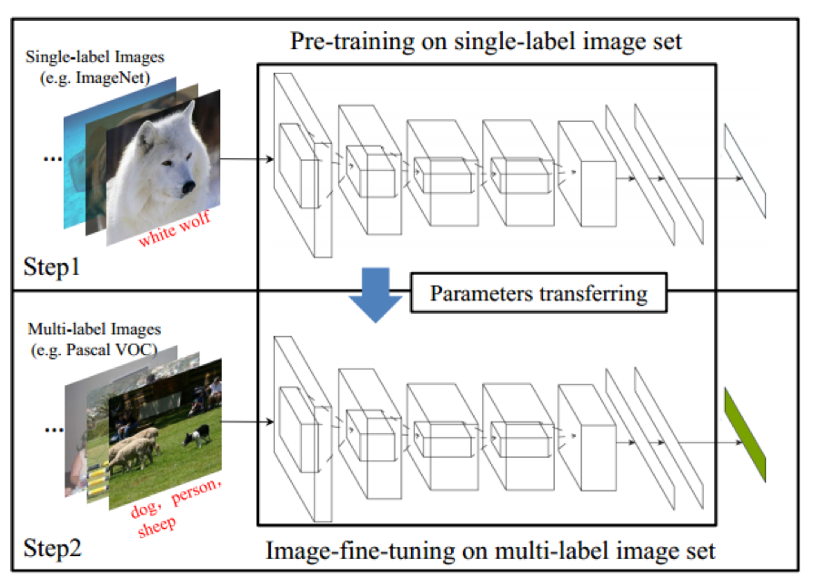

# Convolution Neural Network
####[他人整理之深度學習筆記](http://blog.csdn.net/u013088062/article/details/47656995)

+ [DeepTrack: Learning Discriminative Feature Representations Online for Robust Visual Tracking](https://arxiv.org/pdf/1503.00072.pdf)
  + [Abbr.]
  > Using CNN for Tracking
  + [ Problem ]
  > DNN is impractical for online <strong>visual tracking</strong> because requires very long training time and a large number of training samples

  + [ Proposed Method ]
  > 1. Design a truncated structural loss function to reduce the risk of tracking error accumulation
  > 2. Enhance the ordinary Stochastic Gradient Descent approach in CNN training with a robust sample selection mechanism.
  > 3. ...

+ [SuperCNN: A Superpixelwise Convolutional Neural Network for Salient Object Detection](http://www.shengfenghe.com/uploads/1/5/1/3/15132160/supercnn_ijcv2015.pdf),IJCV 2015
  + [ Abbr. ]
  > Using CNN with 3 segmented things( SLIC superpixel segmentation, )
  + [ Contribution ]
  > + A novel superpixel-wise convolutional neural network approach is proposed.
  > + Two kinds of sequence code are designed as input feature to CNN.
  > 
  > formulate salient
object detection as a binary labeling problem to predict
whether an input region is salient.

+ [Predicting Eye Fixations using Convolutional Neural Networks ](http://ieeexplore.ieee.org/stamp/stamp.jsp?arnumber=7298633)
  + 

+ [ HCP model: Single-label to Multi-label](http://arxiv.org/abs/1406.5726)
  + 生成hypotheses
  > 1. 輸入一張圖片
  > 2. 使用BING提取1k個hypotheses，然後用IoU作為距離使用Normalized Cut，聚成了M個cluster。
  > 3. 捨棄掉其中太小的或者長寬比太大的圖片
  > 4. 對於每個cluster，提取topk作為最後的hypotheses

  >  
+ pre-train
> 1. 先用AlexNet對ImageNet的cls120w問題訓練一個model
> 2. 替換掉model的最後一層，修改loss，使用上面訓練得到model來fine-tuning。

###DeepID系列
+ [Deep Learning Face Representation from Predicting 10000 classes](Deep Learning Face Representation from Predicting 10000 classes)
+ [Deep Learning Face Representation by Joint Identification Verification](https://arxiv.org/pdf/1406.4773v1)
+ [Deep Learning face representation are sparse, selective and robust](http://www.cv-foundation.org/openaccess/content_cvpr_2015/papers/Sun_Deeply_Learned_Face_2015_CVPR_paper.pdf)
