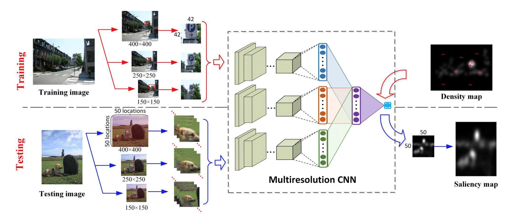
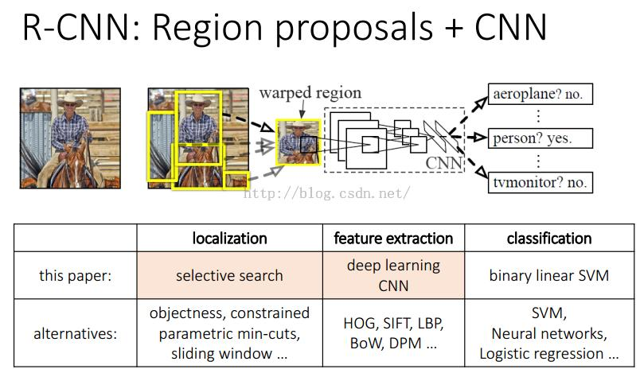

# Using CNN

## [ BASIC ] ##
#### LeCunNet ####

#### AlexNet ####

#### VGG Net ####

## [ ADVANCE IMPROVEMENT ] ##

#### Multiresolution convolutional neural network (Mr-CNN)####

#### R-CNN###

